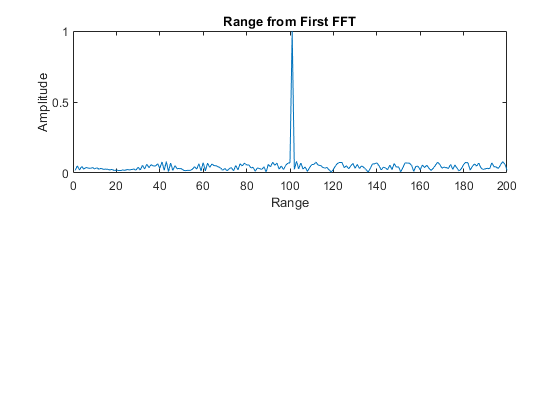
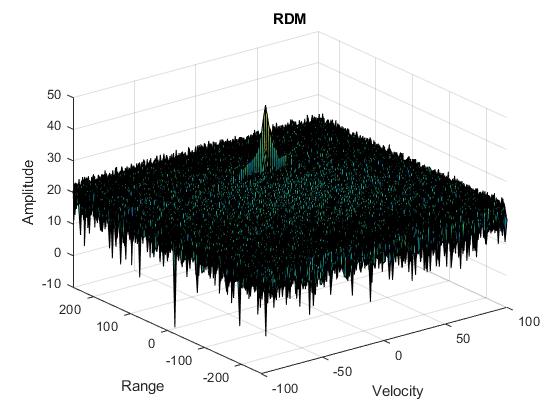
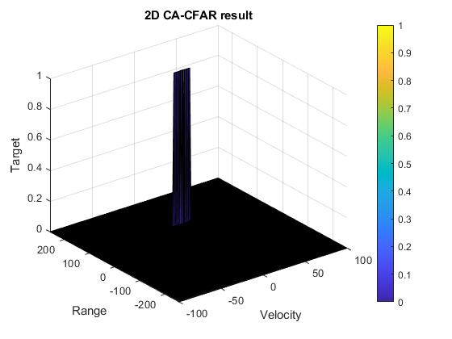
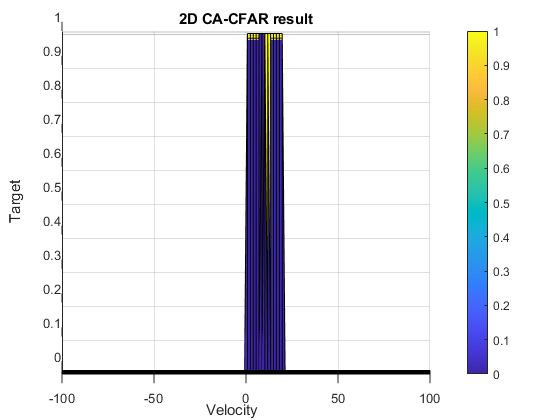

# SFND Radar Project Readme
## Final Result
The parameters used in the project is:
* Initial distance from the target: `100m`;
* Velocity: `10m/s`.

The results of the project can be viewed below:
* Initial signal FFT result: (object detected correctly at 100m distance)

* The RDM output:

* CA-CFAR applied onto the RDM: (only the detected signal is highlighted; rest suppressed to 0)

* Side view of the CA-CFAR result: (object velocity can be seen as around 10)


## Question 1: 2D CFAR
Expanding the CA-CFAR to 2D world is essentially similar to the **convolution** in computer vision; it's just the operation performed onto the sliding window is different. Here after we retrieve the sliding window, we want to see the noise produced by summing together all training cells. My steps in pseudo-code:
```
for i in range(1+Tr+Gr : len-Tr-Gr):
    for j in range(1+Td+Gd : len-Td-Gd):
        curr_window_train = input(i-Tr-Gr : i+Tr+Gr, j-Td-Gd : j+Gd+Td) // technically speaking, here the train group includes guard and CUT
        curr_window_guard = input(i-Gr : i+Gr, j-Gd : j+Gd) // similar to the above, here the guard group includes CUT as well
        noise = sum(everything in the curr_window_train) - sum(everything in the curr_window_guard)

        threshold = noise / number_of_training_cell + offset

        if (input(i, j) > threshold):
            output(i, j) = 1
        else:
            output(i, j) = 0
```

## Question 2: Values for Training, Guard cells and offset
I experimented a bit before choosing:
* Tr: 10
* Td: 8
* Gr: 6
* Gd: 6
* offset: 6
Which produces the desired one-peak shape of the object. However, I started with some random small values, like `Tr = 10; Td = 6; Gr = 6; Gd = 4; offset = 5`, and the result looks as below:

So we detected multiple "signals" for the same target. This clearly indicates that the "training" we are using to get the noise is too small as compared to the whole region, and more noise is treated as actual signal because of that. So I experiented by increasing the size of the sliding window, as well as numping up the offset a bit, such that we filter out the noise.

## Question 3: Edge handling
So I initialized the output to be a different matric from the beginning, populated all the entries with value 0, so no issues here. Of course, when comparing the concept here to computer vision, I believe what's being asked here is essentially the **padding** operation, which is doing the same thing that we could "enlarge" the original image and fill those new pixels with 0.